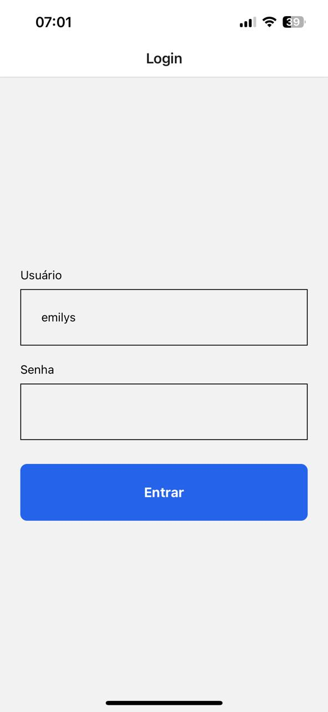
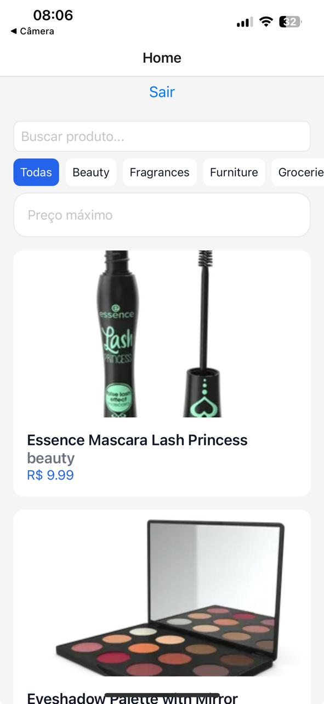
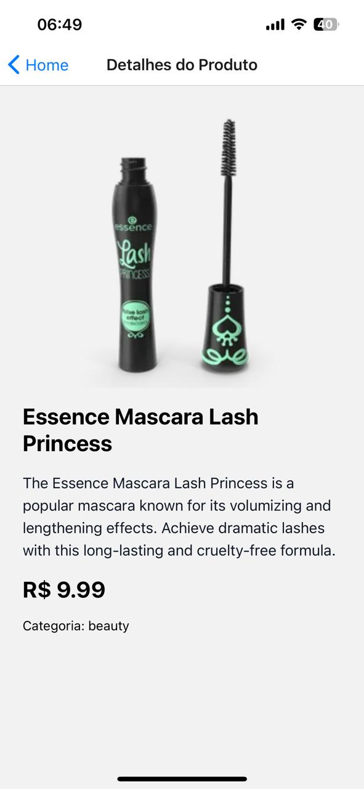

# Mobile Products App

Aplicação mobile desenvolvida em React Native com Expo para listagem e gerenciamento de produtos consumindo a API pública da DummyJSON.

---

# Tecnologias Utilizadas

## Principais

* React Native
* TypeScript
* Expo
* React Navigation
* TanStack Query (React Query)
* React Hook Form
* Zod
* Axios
* AsyncStorage

---

#  Arquitetura do Projeto

```txt
src/
├── api/           # Configuração do axios/interceptors
├── components/    # Componentes reutilizáveis
├── hooks/         # Hooks customizados
├── navigation/    # Navegação da aplicação
├── providers/     # Context Providers
├── schemas/       # Schemas Zod
├── screens/       # Telas
├── services/      # Requests organizadas
├── storage/       # Persistência local
├── styles/        # Tema e design system
├── types/         # Tipagens globais
└── utils/         # Helpers
```

---

#  Funcionalidades

## Autenticação

* Login com React Hook Form + Zod
* Persistência de sessão
* Armazenamento de token com AsyncStorage
* Interceptors com Axios
* Logout automático em erro 401

---

## Produtos

* Listagem de produtos
* Busca com debounce
* Infinite scroll
* Pull to refresh
* Cache inteligente com React Query
* Skeleton loading
* Tela de detalhes do produto
* Tratamento de loading/error/empty states

---

#  Decisões Técnicas

## React Query

Utilizado para gerenciamento de estado remoto, cache, paginação e sincronização de dados.

Benefícios:

* Cache automático
* Controle de loading/error
* Infinite queries
* Melhor performance

---

## Context API

Utilizado para gerenciamento global de autenticação.

---

## Axios Interceptors

Criados para:

* Injetar token automaticamente
* Centralizar tratamento de erros
* Preparar arquitetura para refresh token

---

#  Screenshots

## Login



## Home



## Product Details



---

# Como executar

## Instalar dependências

```bash
npm install
```

---

## Rodar projeto

```bash
npx expo start
```

---

#  Login para testes

API DummyJSON:

```txt
username: emilys
password: emilyspass
```

---

#  Diferenciais Implementados

* Infinite Scroll
* Debounce Search
* Skeleton Loading
* Pull to Refresh
* React Query Cache
* Hooks customizados
* Arquitetura escalável
* Design system simples
* Interceptors globais

---

#  Autor

Thomas Oliveira
# teste-mobile
# teste-mobile
